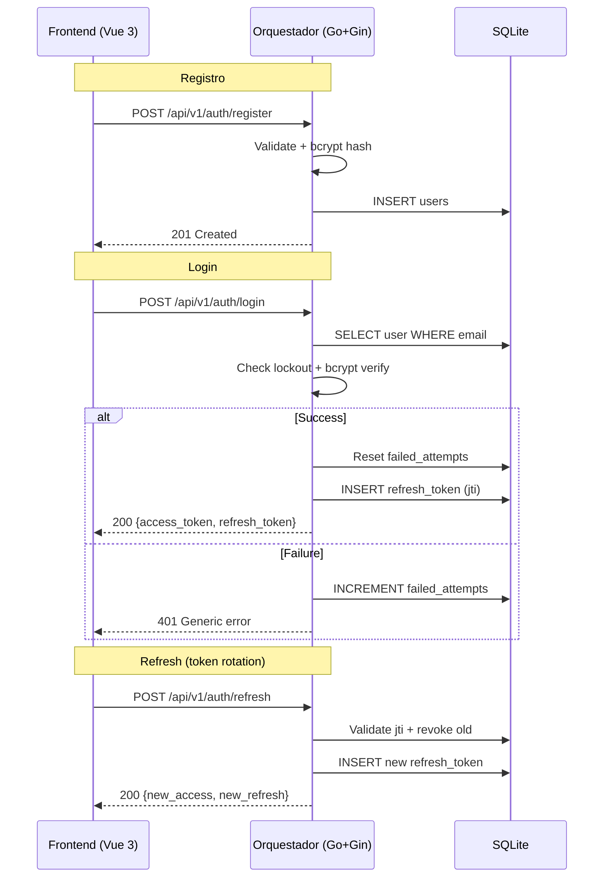
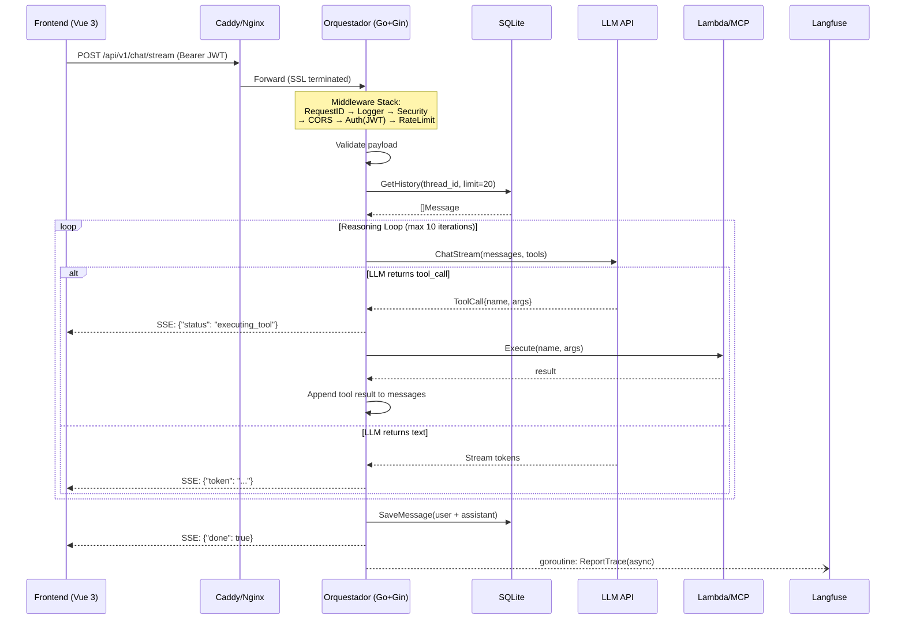

# Orquestador Multi-Agéntico Go + Gin — Plan de Implementación

## Contexto

Servicio orquestador "ligero" en Go + Gin que administra el ciclo de vida de peticiones multiagente: recibe preguntas del frontend (Vue 3), rehidrata contexto desde SQLite, ejecuta un **bucle de razonamiento con tool-calling** contra APIs de LLM (OpenAI / Anthropic / Gemini), despacha herramientas externas (Lambdas, MCP), entrega respuestas en **SSE streaming** y registra telemetría en Langfuse de forma asíncrona.

La infraestructura corre en un VPS bare-metal (Vultr, Santiago de Chile) detrás de Caddy/Nginx gestionado por systemd.

---

## Análisis de la arquitectura propuesta

### ✅ Puntos fuertes que se mantienen
- SSE en vez de WebSockets → más simple, HTTP/1.1 compatible, ideal para streaming unidireccional.
- Orquestador "tonto" → toda la lógica de decisión vive en el LLM, Go solo orquesta.
- Goroutines para telemetría → 0ms de latencia añadida al usuario.
- SQLite local → latencia cero para contexto de conversación.

### ⚠️ Gaps identificados y mejoras propuestas

| # | Aspecto | Gap en los docs | Propuesta |
|---|---------|----------------|-----------|
| 1 | **Autenticación completa** | No se menciona mecanismo de auth | Sistema propio: registro + login con usuario/contraseña. Passwords con `bcrypt` (cost 12). JWT access token (15min) + refresh token (7d) con rotación. |
| 2 | **Base de datos de usuarios** | Sin mención | Tabla `users` en SQLite con `email` (unique), `password_hash`, `tenant_id`, `role`, `is_active`, `failed_login_attempts`, `locked_until`. |
| 3 | **Protección contra brute force** | Sin mención | Lockout tras N intentos fallidos (configurable). Rate limit en `/auth/login`. Timing-safe comparison. |
| 4 | **Rate Limiting** | Sin mención | Rate limiter per-tenant con token bucket en memoria (configurable). Protege contra abuso y controla costos de LLM. |
| 5 | **Validación de Input** | Sin mención | Validación estricta de payloads con `validator/v10`. Sanitización de prompts (largo máximo, caracteres). |
| 6 | **CORS** | Sin mención | Configuración estricta de CORS: solo origins permitidos, métodos explícitos. |
| 7 | **Timeout y Circuit Breaker** | Sin mención | Timeouts configurables por etapa (LLM call, tool call). Context con deadline para cancelar goroutines huérfanas. |
| 8 | **Secrets Management** | Sin mención | API keys desde variables de entorno, nunca hardcoded. Struct `Config` cargada al inicio con validación. |
| 9 | **Request ID / Tracing** | Parcial (Langfuse) | Request ID (UUID) inyectado como middleware. Propaga en todos los logs y headers de respuesta. |
| 10 | **Structured Logging** | Sin mención | `zerolog` con output JSON. Cada log lleva `request_id`, `tenant_id`, `thread_id`. |
| 11 | **Graceful Shutdown** | Sin mención | Signal handling para SIGTERM/SIGINT. Drena conexiones SSE activas antes de cerrar. |
| 12 | **Health Check profundo** | Superficial | `/health` verifica: proceso vivo + SQLite accesible + conectividad LLM (cache TTL). |
| 13 | **Helmet-style Headers** | Sin mención | Headers de seguridad: `X-Content-Type-Options`, `X-Frame-Options`, `Strict-Transport-Security`, etc. |
| 14 | **Error Handling** | Sin definición clara | Errores internos NUNCA se exponen al cliente. Respuestas con códigos HTTP semánticos + mensaje genérico. Recovery middleware para panics. |

---

## User Review Required

> [!IMPORTANT]
> **Decisiones que requieren tu input:**
> 1. **¿Qué LLM providers arrancamos?** — Implemento una interfaz `LLMProvider` con OpenAI como primera implementación. ¿Arrancamos con OpenAI solo?
> 2. **¿SQLite puro o con extensiones vectoriales tipo `sqlite-vec`?** — El doc menciona "pgvector" pero la infra dice SQLite. Propongo SQLite puro para MVP y extensiones vectoriales como fase posterior.
> 3. **¿Rate limit global o por plan/tenant?** — Propongo configurable por tenant con defaults globales.
> 4. **¿Registro abierto o solo por invitación?** — Propongo registro abierto con validación de email en MVP, restricción por tenant en fase posterior.

> [!WARNING]
> **El doc de infra menciona "SQLite con pgvector"** → pgvector es exclusivo de PostgreSQL. Para el MVP propongo **no incluir búsqueda vectorial** en el orquestador (el MCP en Cloudflare Workers se encargaría de eso según la arquitectura).

---

## Proposed Changes

### Estructura del Proyecto

```
go-gin-agent/
├── cmd/
│   └── server/
│       └── main.go              # Entry point, wiring, graceful shutdown
├── internal/
│   ├── config/
│   │   └── config.go            # Configuración desde env vars
│   ├── middleware/
│   │   ├── auth.go              # JWT validation middleware
│   │   ├── cors.go              # CORS config
│   │   ├── ratelimit.go         # Token bucket per-tenant
│   │   ├── requestid.go         # UUID per request
│   │   ├── security.go          # Security headers + recovery
│   │   └── logger.go            # Request logging
│   ├── handler/
│   │   ├── auth.go              # POST /auth/register, /auth/login, /auth/refresh
│   │   ├── chat.go              # POST /api/v1/chat/stream (SSE)
│   │   ├── health.go            # GET /health
│   │   └── webhook.go           # POST /api/v1/webhooks
│   ├── service/
│   │   ├── auth.go              # Auth business logic (hash, verify, tokens)
│   │   ├── orchestrator.go      # Bucle de razonamiento (tool-calling loop)
│   │   └── telemetry.go         # Langfuse async reporting
│   ├── llm/
│   │   ├── provider.go          # Interface LLMProvider
│   │   ├── openai.go            # OpenAI implementation
│   │   └── types.go             # Shared types (Message, ToolCall, etc.)
│   ├── tools/
│   │   ├── registry.go          # Tool registry + dispatch
│   │   ├── lambda.go            # AWS Lambda executor
│   │   └── mcp.go               # MCP client
│   ├── store/
│   │   ├── sqlite.go            # SQLite connection + migrations
│   │   ├── conversation.go      # CRUD conversaciones
│   │   ├── user.go              # CRUD usuarios
│   │   └── migrations/
│   │       └── 001_init.sql     # Schema inicial (users + conversations)
│   └── model/
│       ├── conversation.go      # Domain models
│       ├── user.go              # User model
│       └── tenant.go            # Tenant/JWT claims model
├── go.mod
├── go.sum
├── .env.example                 # Template de variables de entorno
├── infra.md
└── arquitectura_base.md
```

---

### Componente 1: Configuración y Entry Point

#### [NEW] [config.go](file:///c:/Users/ebachmann/proyectos/personal/go-gin-agent/internal/config/config.go)
- Struct `Config` con campos para: `Port`, `JWTSecret`, `JWTRefreshSecret`, `AllowedOrigins`, `OpenAIKey`, `SQLitePath`, `LangfusePublicKey`, `LangfuseSecretKey`, `LangfuseHost`, `MaxRequestBodySize`, `RateLimitRPM`, `LLMTimeoutSeconds`, `BcryptCost`, `MaxLoginAttempts`, `LockoutDurationMinutes`, `AccessTokenTTL`, `RefreshTokenTTL`.
- Carga desde env vars con `os.Getenv` + validación de requeridos al arranque.
- Panic explícito si algún secret crítico falta (fail-fast).

#### [NEW] [main.go](file:///c:/Users/ebachmann/proyectos/personal/go-gin-agent/cmd/server/main.go)
- Carga config, inicializa SQLite store, crea `AuthService`, crea router Gin con middleware stack, registra rutas (auth públicas + API protegidas), ejecuta servidor HTTP con `http.Server` + graceful shutdown via `signal.NotifyContext`.

---

### Componente 2: Middleware Stack (Security First)

#### [NEW] [requestid.go](file:///c:/Users/ebachmann/proyectos/personal/go-gin-agent/internal/middleware/requestid.go)
- Genera UUID v4 por request. Lo inyecta en `c.Set("request_id", id)` y en header `X-Request-ID`.

#### [NEW] [logger.go](file:///c:/Users/ebachmann/proyectos/personal/go-gin-agent/internal/middleware/logger.go)
- `zerolog`-based. Loguea: método, path, status, latencia, `request_id`, `tenant_id`, IP.

#### [NEW] [security.go](file:///c:/Users/ebachmann/proyectos/personal/go-gin-agent/internal/middleware/security.go)
- Inyecta headers: `X-Content-Type-Options: nosniff`, `X-Frame-Options: DENY`, `X-XSS-Protection: 1; mode=block`, `Strict-Transport-Security`, `Referrer-Policy: strict-origin-when-cross-origin`.
- Recovery middleware: captura panics, loguea stack trace, devuelve `500` genérico.

#### [NEW] [cors.go](file:///c:/Users/ebachmann/proyectos/personal/go-gin-agent/internal/middleware/cors.go)
- Usa `github.com/gin-contrib/cors`. Origins desde config (whitelist). Métodos: GET, POST, OPTIONS. Headers: `Authorization`, `Content-Type`.

#### [NEW] [auth.go](file:///c:/Users/ebachmann/proyectos/personal/go-gin-agent/internal/middleware/auth.go)
- Extrae access token del header `Authorization: Bearer <token>`.
- Valida con `golang-jwt/jwt/v5` (HMAC-SHA256). Verifica `type: "access"` en claims.
- Extrae `tenant_id`, `user_id`, `role` de claims.
- Inyecta en context: `c.Set("tenant_id", ...)`, `c.Set("user_id", ...)`, `c.Set("role", ...)`.
- Rechaza con 401 si token inválido/expirado/ausente. Mensaje genérico (no revela si expiró vs inválido).

#### [NEW] [ratelimit.go](file:///c:/Users/ebachmann/proyectos/personal/go-gin-agent/internal/middleware/ratelimit.go)
- Token bucket por `tenant_id` usando `golang.org/x/time/rate`.
- Map `sync.Map` de `tenant_id` → `*rate.Limiter`.
- Rate limit más agresivo en rutas de auth (`/auth/login`: 5 req/min por IP).
- Responde 429 si se excede. Header `Retry-After`.

---

### Componente 3: Handlers

#### [NEW] [auth.go](file:///c:/Users/ebachmann/proyectos/personal/go-gin-agent/internal/handler/auth.go)
Endpoints **públicos** (sin JWT middleware):

- `POST /api/v1/auth/register`: recibe `{ "email": "...", "password": "...", "name": "..." }`.
  - Validación: email formato válido, password mínimo 8 chars con al menos 1 mayúscula + 1 número + 1 símbolo.
  - Verifica email no existente (error genérico: "registro procesado" para no revelar si el email existe).
  - Hashea password con bcrypt (cost 12). Crea usuario. Devuelve 201 sin tokens (requiere login explícito).

- `POST /api/v1/auth/login`: recibe `{ "email": "...", "password": "..." }`.
  - Verifica lockout (si `failed_attempts >= max` y `locked_until > now` → 429 genérico).
  - `bcrypt.CompareHashAndPassword` (timing-safe). Si falla → incrementa `failed_attempts`.
  - Si OK → resetea `failed_attempts`, genera access token (15min) + refresh token (7d). Devuelve ambos.
  - **Nunca revela si el email existe o no** (mismo mensaje de error para ambos casos).

- `POST /api/v1/auth/refresh`: recibe `{ "refresh_token": "..." }`.
  - Valida refresh token (claim `type: "refresh"`). Genera nuevo par access + refresh (rotación).
  - Invalida el refresh token anterior (one-time use via `jti` almacenado en DB).

#### [NEW] [chat.go](file:///c:/Users/ebachmann/proyectos/personal/go-gin-agent/internal/handler/chat.go)
- `POST /api/v1/chat/stream`: recibe JSON `{ "thread_id": "...", "message": "...", "attachments": [...] }`.
- Valida payload con `validator/v10`.
- Sets SSE headers (`Content-Type: text/event-stream`, `Cache-Control: no-cache`, `Connection: keep-alive`, `X-Accel-Buffering: no`).
- Llama al servicio `Orchestrator.Run()` pasando un channel por donde recibe eventos SSE.
- Itera channel y hace `c.SSEvent()` + `c.Writer.Flush()`.
- Context con timeout configurable.

#### [NEW] [health.go](file:///c:/Users/ebachmann/proyectos/personal/go-gin-agent/internal/handler/health.go)
- `GET /health`: verifica SQLite (`SELECT 1`), reporta uptime, versión, uso de memoria (runtime stats).
- Devuelve 200 si todo OK, 503 si SQLite falla.

#### [NEW] [webhook.go](file:///c:/Users/ebachmann/proyectos/personal/go-gin-agent/internal/handler/webhook.go)
- `POST /api/v1/webhooks`: stub inicial con validación de signature (HMAC del body). Placeholder para integraciones.

---

### Componente 4: Auth Service (Security Core)

#### [NEW] [auth.go](file:///c:/Users/ebachmann/proyectos/personal/go-gin-agent/internal/service/auth.go)
Lógica de negocio de autenticación **aislada del handler** (testeable):

- `Register(ctx, email, password, name) (*User, error)`: hashea password, crea usuario en store.
- `Login(ctx, email, password) (*TokenPair, error)`: verifica lockout, compara hash, genera tokens.
- `RefreshToken(ctx, refreshToken) (*TokenPair, error)`: valida, rota, genera nuevo par.
- `GenerateTokenPair(user) (*TokenPair, error)`: crea access (15min, claims: `user_id`, `tenant_id`, `role`, `type:access`) + refresh (7d, claims: `user_id`, `jti`, `type:refresh`).
- `HashPassword(password) (string, error)`: bcrypt con cost configurable.
- `VerifyPassword(hash, password) error`: `bcrypt.CompareHashAndPassword`.
- **Todas las operaciones son timing-safe**: no retorna early en errores que revelen info.

---

### Componente 5: Servicio Orquestador (Bucle de Razonamiento)

#### [NEW] [orchestrator.go](file:///c:/Users/ebachmann/proyectos/personal/go-gin-agent/internal/service/orchestrator.go)
- Método `Run(ctx, tenantID, threadID, userMessage, attachments) <-chan SSEvent`.
- **Flujo**:
  1. Rehidrata historial desde `store.GetConversationHistory(threadID, limit)`.
  2. Construye messages array (system prompt + history + user message + attachments inline).
  3. **Loop** (máx N iteraciones para evitar loops infinitos):
     - Llama a `LLMProvider.ChatStream(ctx, messages, tools)`.
     - Si respuesta es `tool_call` → despacha herramienta via `ToolRegistry.Execute()`, append resultado, continúa loop.
     - Si respuesta es `text` → stream tokens al channel, break.
  4. Persiste intercambio en SQLite.
  5. Dispara goroutine de telemetría.

#### [NEW] [telemetry.go](file:///c:/Users/ebachmann/proyectos/personal/go-gin-agent/internal/service/telemetry.go)
- `ReportAsync(trace)`: goroutine que envía traza a Langfuse HTTP API.
- Incluye: `tenant_id`, tokens in/out, latencia, model used, tool calls ejecutados.
- Retry simple (1 intento) con timeout de 5s. Si falla, loguea y descarta (no afecta al usuario).

---

### Componente 6: LLM Client

#### [NEW] [provider.go](file:///c:/Users/ebachmann/proyectos/personal/go-gin-agent/internal/llm/provider.go)
- Interface:
```go
type LLMProvider interface {
    ChatStream(ctx context.Context, messages []Message, tools []ToolDef) (<-chan StreamEvent, error)
}
```

#### [NEW] [types.go](file:///c:/Users/ebachmann/proyectos/personal/go-gin-agent/internal/llm/types.go)
- `Message`, `ToolCall`, `ToolDef`, `StreamEvent` (tipos: `token`, `tool_call`, `done`, `error`).

#### [NEW] [openai.go](file:///c:/Users/ebachmann/proyectos/personal/go-gin-agent/internal/llm/openai.go)
- Implementación de `LLMProvider` para OpenAI API.
- Streaming via SSE del endpoint `/v1/chat/completions` con `stream: true`.
- Parseo de chunks SSE del LLM, emite `StreamEvent` al channel.
- Timeout y cancelación via context.

---

### Componente 7: Tool Registry

#### [NEW] [registry.go](file:///c:/Users/ebachmann/proyectos/personal/go-gin-agent/internal/tools/registry.go)
- Map `name → ToolExecutor`. Método `Register(name, executor)` y `Execute(ctx, name, args) (string, error)`.

#### [NEW] [lambda.go](file:///c:/Users/ebachmann/proyectos/personal/go-gin-agent/internal/tools/lambda.go)
- Invoca AWS Lambda via HTTP (API Gateway URL). Timeout configurable.

#### [NEW] [mcp.go](file:///c:/Users/ebachmann/proyectos/personal/go-gin-agent/internal/tools/mcp.go)
- Cliente HTTP para MCP server (Cloudflare Workers). Envía query, recibe contexto.

---

### Componente 8: Persistencia (SQLite)

#### [NEW] [sqlite.go](file:///c:/Users/ebachmann/proyectos/personal/go-gin-agent/internal/store/sqlite.go)
- Abre SQLite con `modernc.org/sqlite` (pure Go, sin CGO).
- Ejecuta migrations al arranque.
- `PRAGMA journal_mode=WAL; PRAGMA foreign_keys=ON; PRAGMA busy_timeout=5000;`

#### [NEW] [user.go](file:///c:/Users/ebachmann/proyectos/personal/go-gin-agent/internal/store/user.go)
- `CreateUser(ctx, user) error`.
- `GetUserByEmail(ctx, email) (*User, error)`.
- `GetUserByID(ctx, id) (*User, error)`.
- `IncrementFailedAttempts(ctx, userID) error`.
- `ResetFailedAttempts(ctx, userID) error`.
- `LockUser(ctx, userID, until) error`.
- `SaveRefreshToken(ctx, userID, jti, expiresAt) error`.
- `RevokeRefreshToken(ctx, jti) error`.
- `IsRefreshTokenValid(ctx, jti) (bool, error)`.

#### [NEW] [conversation.go](file:///c:/Users/ebachmann/proyectos/personal/go-gin-agent/internal/store/conversation.go)
- `SaveMessage(threadID, role, content string)`.
- `GetHistory(threadID string, limit int) []Message`.

#### [NEW] [001_init.sql](file:///c:/Users/ebachmann/proyectos/personal/go-gin-agent/internal/store/migrations/001_init.sql)
```sql
-- Usuarios
CREATE TABLE IF NOT EXISTS users (
    id TEXT PRIMARY KEY,              -- UUID v4
    tenant_id TEXT NOT NULL,
    email TEXT NOT NULL UNIQUE,
    password_hash TEXT NOT NULL,
    name TEXT NOT NULL,
    role TEXT NOT NULL DEFAULT 'user' CHECK(role IN ('admin','user')),
    is_active BOOLEAN NOT NULL DEFAULT 1,
    failed_login_attempts INTEGER NOT NULL DEFAULT 0,
    locked_until DATETIME,
    created_at DATETIME DEFAULT CURRENT_TIMESTAMP,
    updated_at DATETIME DEFAULT CURRENT_TIMESTAMP
);
CREATE UNIQUE INDEX IF NOT EXISTS idx_users_email ON users(email);
CREATE INDEX IF NOT EXISTS idx_users_tenant ON users(tenant_id);

-- Refresh tokens (para rotación y revocación)
CREATE TABLE IF NOT EXISTS refresh_tokens (
    jti TEXT PRIMARY KEY,             -- JWT ID único
    user_id TEXT NOT NULL REFERENCES users(id),
    expires_at DATETIME NOT NULL,
    revoked BOOLEAN NOT NULL DEFAULT 0,
    created_at DATETIME DEFAULT CURRENT_TIMESTAMP
);
CREATE INDEX IF NOT EXISTS idx_rt_user ON refresh_tokens(user_id);

-- Conversaciones
CREATE TABLE IF NOT EXISTS conversations (
    id INTEGER PRIMARY KEY AUTOINCREMENT,
    thread_id TEXT NOT NULL,
    tenant_id TEXT NOT NULL,
    user_id TEXT NOT NULL REFERENCES users(id),
    role TEXT NOT NULL CHECK(role IN ('user','assistant','system','tool')),
    content TEXT NOT NULL,
    tool_call_id TEXT,
    created_at DATETIME DEFAULT CURRENT_TIMESTAMP
);
CREATE INDEX IF NOT EXISTS idx_conv_thread ON conversations(thread_id, created_at);
CREATE INDEX IF NOT EXISTS idx_conv_tenant ON conversations(tenant_id);
CREATE INDEX IF NOT EXISTS idx_conv_user ON conversations(user_id);
```

---

### Componente 9: Domain Models

#### [NEW] [user.go](file:///c:/Users/ebachmann/proyectos/personal/go-gin-agent/internal/model/user.go)
- Struct `User`: `ID`, `TenantID`, `Email`, `PasswordHash`, `Name`, `Role`, `IsActive`, `FailedLoginAttempts`, `LockedUntil`, `CreatedAt`, `UpdatedAt`.
- Struct `TokenPair`: `AccessToken`, `RefreshToken`, `ExpiresAt`.
- Struct `RegisterRequest`: `Email`, `Password`, `Name` (con tags `validate` y `json`).
- Struct `LoginRequest`: `Email`, `Password`.
- Struct `RefreshRequest`: `RefreshToken`.

#### [NEW] [conversation.go](file:///c:/Users/ebachmann/proyectos/personal/go-gin-agent/internal/model/conversation.go)
- Struct `ConversationMessage`: `ID`, `ThreadID`, `TenantID`, `UserID`, `Role`, `Content`, `ToolCallID`, `CreatedAt`.

#### [NEW] [tenant.go](file:///c:/Users/ebachmann/proyectos/personal/go-gin-agent/internal/model/tenant.go)
- Struct `Claims` con `jwt.RegisteredClaims` embebido: `TenantID`, `UserID`, `Role`, `TokenType` (`access`/`refresh`).

---

## Diagrama de flujo del request

### Flujo de Autenticación


### Flujo de Chat (protegido)


---

## Verification Plan

### Compilación y estructura
```powershell
cd c:\Users\ebachmann\proyectos\personal\go-gin-agent
go build ./cmd/server/...
```
Verifica que el proyecto compila sin errores.

### Test unitarios
- Escribiré tests para los componentes críticos: middleware de auth (token válido/inválido/expirado), rate limiter (permite/rechaza), y el store de conversaciones (save/get).
- Comando:
```powershell
cd c:\Users\ebachmann\proyectos\personal\go-gin-agent
go test ./internal/... -v -count=1
```

### Verificación manual
1. Arrancar el servidor: `go run ./cmd/server/...`
2. `GET /health` → debe devolver 200 con status JSON.
3. `POST /api/v1/auth/register` → crear usuario de prueba.
4. `POST /api/v1/auth/login` → obtener tokens.
5. `POST /api/v1/auth/login` con password incorrecto × N → verificar lockout (429).
6. `POST /api/v1/chat/stream` sin token → debe devolver 401.
7. `POST /api/v1/chat/stream` con access token → debe aceptar.
8. `POST /api/v1/auth/refresh` → verificar rotación de tokens.
9. Verificar headers de seguridad en las respuestas con `curl -v`.

> [!NOTE]
> Para el test manual del flujo completo de chat con LLM se necesitará una API key real de OpenAI. Los tests unitarios usarán mocks del `LLMProvider` interface.
